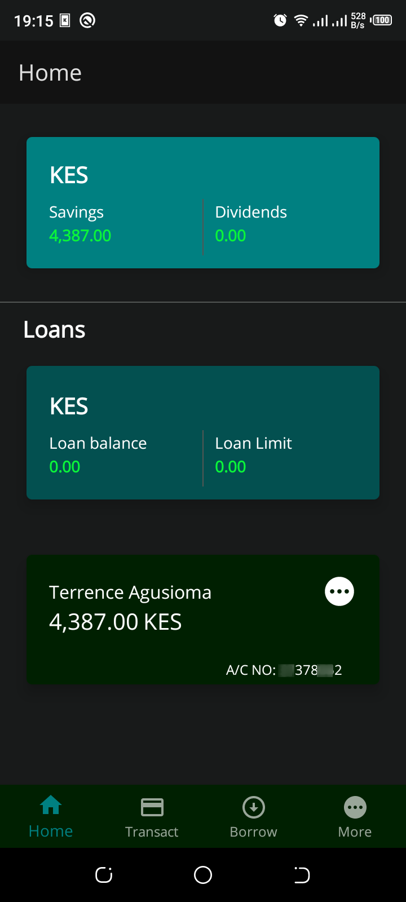
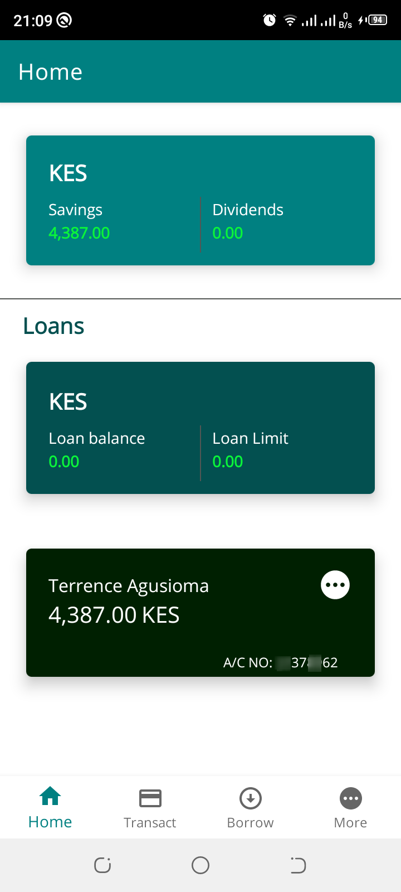

# t-bank-app

This is a mini-banking app whose logic is based on [this](https://sacco.terrence-aluda.com/) website. It allows basic functionalities such as depositing, viewing statements, viewing balances, updating details etc. Currently, the deposit functionality is still being worked on. On completion, the app should have these features:

1. Deposit
2. Send money
3. Viewing transactions
4. Account details update
5. Password update

### Technologies used
For the **backend**, PHP's Laravel and Java was used. The Laravel repository and its details is found in this [repository](https://github.com/Agusioma/t-bank-app).

For the **UI**, Android's XML styling was used.

For the **network requests** and communitcation Retrofit library was used.

> It is still under development and it may have some bugs(not yet on Google Playstore).

### Screenshots
Some of the screens

## i. Login(Dark)

## ii. Login(Light)

## iii. Home(Dark)

## iv. Home(Light)

## v. Update details(Dark)

## vi. Password details(Light)

## vii. Statement details(Light)

## viii. Account details

## ix.  Contact us

